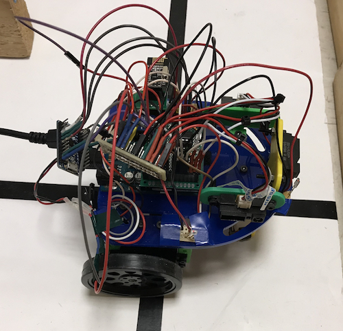

# Final Documentation

To build an autonomous physical system that successfully navigates a maze, detects treasure, and displays real-time information, our team completed many intermediate steps to ensure a robust and smoothly integrated final product. Our team completed 4 labs and 4 milestones that each focused on a specific task the robot was required to operate, ranging from line following to radio communication. While these individual tasks helped us integrate the robot, we also gained experience from the effects of many different components interacting with each other, facing hardware issues, bugs, noise, and interference. This final report documents our team's progress throughout the labs, milestones, and intermediate steps and how they contributed to the final robot implementation. 

# The Labs

The labs were more designed to provide component-level design ideas. The concepts explored in each lab directly correlated to specific objectives in the final competition, from using sensors and the Arduino FFT library to detect specific signal frequencies, to using the VGA to draw shapes and lines of varying color on the monitor.

## Lab 1

### Lab 1 Objectives
The goal of the first lab was to introduce us to coding in Arduino and write basic programs for the Arduino Uno, as well as become familiar with the Arduino Uno itself. Having familiarized ourselves with the basic functions and syntax used in Arduino before the lab, we then had to modify some basic example sketches during the lab. 

We then created the basic form of our robot that we would be working on for the entire semester. Once we all gained some experience using the Arduino Uno and wrote some code for it, we were to write a simple script which allowed the robot to move in some kind of capacity.

### Lab 1 Contributions
The first thing that we worked on as a group for the class was modifying the blink sketch. This gave us a solid introduction to the programming language used for the Arduino Uno, as well as showed us how the pins are set up on the board. 

The next step for this lab involved setting up a simple voltage-divider circuit with a potentiometer to input an analog voltage to the Arduino Uno and display it on the serial monitor. This not only gave us good practice in using the analog pins on the Arduino, but it also introduced us to how the serial monitor works and how it can help us debug our code. We also learned that when inputting to the Arduino we must always make sure to but the pin in series with a 330 Ohm resistor.

The next sections introduced us to a major limitation of the Arduino Uno. We needed to output an analog signal to a circuit we made to change the brightness of an external LED, but the Arduino could only output digital signals. We overcame this obstacle by using the pulse-width modulator (PWM) functionality of the Arduino Uno. We used one of the digital pins with this capability to adjust the brightness of an external LED using a potentiometer. 

We then used another pin with the same PWM compatibility to control the Parallax Servos. This involved us first familiarizing ourselves with the Arduino Servo.h library and the servo itself. We then wrote a simple program to change the speed and direction that the servo motor moved in to gain some perspective on how it works and how we could implement it with our robot in the future. 

The final part of the first lab involved putting together the basic structure of our robot. After putting together the servos and the wheels, the wheels were attached to wheel trusses. These were then attached to the chassis as well as a ball caster. The servos were then connected to the Arduino’s 5 V pin, it’s ground pin, and two different digital pins. We wrote two programs to tell the robot to autonomously move in a square and a figure 8. This lab was a great way to launch our project and become familiar with the tools that we would use for the rest of this semester.

## Lab 2

### Lab 2 Objectives
Lab 2 was designed to introduce the Arduino FFT library. This library would eventually prove vital to the treasure detection and start signal components of this lab.

Further, the lab was split into two halves, each of which was to be completed by two sub-teams. The first half involved receiving an audio signal, putting it through a filter to reduce noise, amplifying it, and identifying the frequency of a specific sound.

The second half involved assembling an IR circuit which could detect a 7 kHz beacon. This process, similar to the first half, also required filters and amplifiers.

### Lab 2 Contributions
Throughout this lab, we developed a familiarity with the FFT which proved to be absolutely vital for the detection of various signals. In addition, we had to regularly use oscilloscopes and frequency generators in order to test and troubleshoot our circuits and code.

For the microphone, our team first decided to use fft library’s ADC (analog to digital converter) over the default analogRead function because of the additional delay inherent in analogRead. We then created an amplifier circuit and a bandpass filter in order to gain a clearer readout of a detected audio signal. While the non-inverting amplifier successfully increased the gain by 10x, the bandpass filter did not function as intended, providing a negligible drop of 1 decibel when an 8 kHz signal was fed into the filter.

The optical team had more success, as their circuit was able to amplify incoming signals and apply a high-pass filter, allowing the Arduino to accurately detect treasure signals from a very far distance. This sensor code, and the circuitry associated with it, were eventually used on the final robot to detect treasures. However, we ended up making adjustments to the code in order to reduce its sensitivity, as detailed in the Milestone 2 Contributions section. 

## Lab 3

### Lab 3 Objectives
Lab 3 introduced how the FPGA would display a simple 2x2 grid on a monitor and output different sounds to the speaker. The 2x2 grid would feature a “moving” robot (different-colored square) based on external inputs. Achieving this goal is especially important since it was the foundation for being able to display walls, treasures, and the robot’s real-time movement.

### Lab 3 Contributions
While it seemed simple to draw a couple of boxes and change their colors based on external inputs, the Verilog code took a significant time to debug and became increasingly convoluted as features were added. After much debugging, trying different conditional statements, and updating variables to have the expected value at the expected time, we were able to display the grid and moving box. 

This lab helped to organize our thoughts on timing and updating the grid’s colors, which gave us familiarity with using Verilog and allowed us to display more complex visuals down the road. 

As for the “done” sound to the speaker, we successfully designed a circuit to implement that on the FPGA. Later, that very same circuit would be placed on the Base Station in order to play the finishing tone upon completing the maze exploration.

## Lab 4

### Lab 4 Objectives
Lab 4 introduced wireless communication and more complex maze display. We were given a couple of options in terms of the format for each packet sent, ranging from an entire maze array to a short stream of information based on certain external inputs (such as a “moved” signal). 

### Lab 4 Contributions
Based on the given radio code, we had little issues with transmitting and receiving sample arrays of information. However, we did have to consider what information was necessary to send to the base station and how we would format it. 

Because our radio packet could only send 8 bits at a time, we used as few bits as possible to represent x/y movement (x for East/West, y for North/South), +/- movement (+ for North and East, - for South and West), treasure detection, wall detection, and whether the robot moved at all.

Figure 1

Note1: Wall bits are relative to robot position and not to cardinal directions.

Note2: Treasure bits: B00=no treasure, B01=7kHz, B10=12kH, B11=17kHz.

This was an effective method of communication and enabled the robot’s position to be displayed and updated on the monitor, since the robot’s initial position was given. The Verilog code was updated to include information about whether a node had been visited before, and was tested to ensure correct responsivity to the Arduino’s signal. These components all contributed heavily to the base station and communication protocol.

# The Milestones
The milestones were designed to help implement any insights gained from the Lab activities into the actual robot. Each milestone completed resulted in our robot growing more capable, more complex, and more difficult to troubleshoot.

## Milestone 1 
<i>The players experiment with their pieces, seeing how they move in their little world of white and black. </i>

### Milestone 1 Objectives

The first stated goal of Milestone 1 is to create a robot which can follow a line. The next goal is code the robot to follow a figure-8 pattern in a grid of lines. Additional emphasis was placed on the robustness and speed of the line following solution.

However, Milestone 1 presented additional issues our team was forced to hurdle in order to fulfill every requirement.

First, we had to consider the general layout of our robot. Further, once the chassis and wheels were decided upon, we had to decide the placement and quantity of line sensors required to effectively follow the lines and turn at intersections.

### Milestone 1 Contributions

Upon completing Milestone 1, our team settled for using the provided chassis and red wheels. Initial line sensor layout consisted of two line sensors in the front of our robot and two line sensors placed outside of the wheels.

During our meetings, we regularly discussed the possibility of changing the design; after all, it was our opportunity to make our robot stand out more compared to the competition. Our ideas ranged from a chassis with very low ground clearance and large wheels, to a taller robot with a camera attached to an extendable arm. In the end, however, we did not act on any of these ideas, and we did not make significant changes to our robot’s design.

Additionally, the line follower algorithm and code remained largely unchanged until the day before the competition, where we increased some of the values were slightly to make the adjustments more aggressive. The result was that our robot’s line following became more precise and its movements became more consistent.

## Milestone 2
<i>There is a certain level of complexity to this game. The pieces must not move blindly.</i>

### Milestone 2 Objectives

Milestone 2 introduced two more obstacles our team had to overcome. Unsurprisingly, in order to traverse the maze, the robot must not only be able to follow a line, but also detect walls to the front or the sides. Additionally, a significant portion of the scoring will be based on the detection of “treasures,” so we had to design rig and create code capable of detecting the three frequencies of treasure.

In regards to our robot’s design, we had to design where to put the wall sensors. However, the milestone did not require for our robot to be able to react to the walls, only detect them.

### Milestone 2 Contributions

The wall detection code developed during this Milestone would eventually be used in the final design. There was a segment of code designed to detect and remove outliers, but we decided to remove the code from the final Arduino code because it took far too long to update the sensors and it consumed precious memory.

We had designed a custom “harness” to hold our wall sensors. At the time, we were planning on placing the wall sensors slightly ahead of the robot, in order to give our robot a sort of early warning upon reaching an intersection. However, towards the end of the semester, we removed the harness, instead deciding to place the wall sensors in top of the chassis. This was because the harness reduced the maneuverability of the robot, knocked down walls, and occasionally gave faulty data.

Figure 2: Original sensor "harness"

Figure 3: Location of wall sensors when attached to the harness

The treasure code was also effectively unchanged until the final day before the competition. We discovered that our treasure detection sensors were extremely sensitive, so we implemented a cutoff amplitude for treasure detection in order for our robot to only detect a treasure when in close proximity (eg: same grid as the treasure). Otherwise, our robot would be able to detect a treasure from across the maze, which would give incorrect an incorrect readout on the mapping.

## Milestone 3
<i>The players strategize. The pieces move with intent. Yet, the game advances at a relentless pace.</i>

### Milestone 3 Objectives
Milestone 3 introduced the maze exploration algorithm that would be integrated with the physical system. This would entail creating a simulation of our exploration and various maze possibilities, since that would allow quick updates. Integrating with physical movement would also introduce many implementation bugs.

### Milestone 3 Contributions
 We started off by considering depth first search and how we could simulate maze exploration. Using the MATLAB example done by Team Alpha, we were able to simulate exploration and visit every node. If a section was blocked off, we would not be able to finish the maze, but for milestone 3, using a maze with all nodes visitable would suffice.

The next challenge was integrating the maze algorithm from MATLAB with the physical movement of the robot. When we first implemented the code, the robot either wouldn’t move past one node or it wouldn’t line follow properly. However, many serial prints later, we managed to have the robot follow the algorithm and visit every node.

## Milestone 4 Contributions
<i>The endgame; The final moves. A last, dogged effort. </i>

### Milestone 4 Objectives
Milestone 4 required integrating all the previous milestones into one functioning, autonomous physical system. We worked on each component at a time, starting with maze exploration, radio, treasure detection, and the done signal. 

### Milestone 4 Contributions
For maze exploration, we decided that the MATLAB algorithm was not integrating well with the robot and used a “backtrack” array to return to the previous position until an unvisited node was a neighbor. This solution worked really well and was quite simple to implement, since the backtrack array stored the previous direction for every node. 

For radio communication, one of our challenges was indicating when the robot completed the maze, given the limited length of bits we could send over. We resolved this issue by sending a signal which represented an impossible situation- a treasure detected but no walls detected. 

# Final Robot Design Specs

Figure 4: Robot Block Diagram

Figure 5: Robot Front

Figure 6: Robot Right Side

Figure 7: Protoboard Top

Figure 8: Protoboard Bottom

## Sensors
### Line Following 

The line following sensors were placed as close to the ground as possible, without touching the floor, to ensure accurate light readings. The front sensors were spaced to hug the borders of a line, and the rear sensors spaced to detect an intersection. Front sensors were useful in line following and early detection of an intersection and 90 degree turns, while rear sensors were useful for placing the robot before its turn.

### IR Treasure Detection

The treasure detection sensors were placed in the back, near the rear line following sensors since the robot would pause at that location before turning. This would give it enough time to detect a treasure. The front treasure detection sensor was placed near the front wall detection sensor, since the front of the robot is extremely close to front walls.

### Wall Detection

We placed the IR distance detection sensors on the front, left, and right of the robot. A wall sensor on the back of the robot was unnecessary, since the robot is only capable of moving forward to a node (we took into account the wall behind the robot for the starting node only). The front wall sensor was placed on a mount on the edge of the chassis board, to prevent interfering with turns and bumping into the wall. The left and right sensors were originally placed close to the front to allow early detection of walls, but we moved them towards the back since the rear line following sensors and the servos were placed in the back.

## Algorithm
Previously, our maze traversal only considered itself done once all grids were visited, however, this ignored any maze where there is an unreachable node in which case our code would run indefinitely as it cannot visit the unreachable nodes. We changed our code to handle these cases by implementing the following algorithm.

An 5x4 array, called explored, stores information about whether a node on the grid has been completely explored. We define completely explored as whether for each side (North, East, South, West) we have 1) detected a wall on that side or 2) visited the neighbor on that side. A node is initially assigned a value of 4 in explored to indicate that we have no information about the four nodes surrounding it. This value is decremented by 1 when either of the two scenarios mentioned above occurs, until explored equals zero. We count each exploration only once to prevent the value in explored from decrementing say if the robot paces back and forth between two nodes.

Figure 9: Grids

Our traversal algorithm is changed slightly to prioritize nodes that are less explored, i.e. if the current node is surrounded by a completely unexplored node (explored[i-1][j] = 4), it will prioritize that node instead of another one that is partly explored (explored[i+1][j] = 3). Since values for explored is only changed for nodes that have been visited or are being visited, unreachable nodes will always have an explored value of 4. Our condition for having traversed all reachable nodes is then determined by if explored holds a zero or four for all grids of the maze.

## Base Station
### Syncing Robot Movement and Grid Mapping
One issue with our maze display was that the robot’s position was consistently one grid ahead of its actual position on the maze. The problem was that our data packets transmit based on movements rather than position; when the radio code transmitted the wall locations for the starting position of the robot, the Verilog code interpreted this as advancing to the next grid. To solve this problem, we had the base station ignore the position data from the first instruction and only care about the wall sensor data. This was done by adding a conditional to the code that updates the x/y position of our robot for normal instructions. 

We used a variable called “first” representing whether the first instruction has been completed that is initialized to zero. If “first” is not equal to zero, then the program will update the grid position as normal; otherwise, we have not executed the first instruction, and we move to the else statement, where the direction is set to north and “first” is incremented by one. The rest of the VGA code remains the same, letting us map any walls or potential treasures from our starting position to the first grid.

### Done Signal
During testing of our VGA code, the done signal for the base station was a conditional checking if all 20 grid spaces were visited. Due to some mazes containing unreachable nodes, this method could no longer be used.

We decided to instead use a particular signal or data pattern to signify to the base station that we had finished traversing the maze. The combination used to designate completion of the maze was the absence of any walls and the presence of the 17kHz treasure. This is an impossible combination for actual traversal since the treasures are attached to the walls and our sensors for both walls and treasures are located at the same position. Additionally, our treasure sensors have rather low range of sensitivity (especially for the 17kHz treasure) and must be very close to the wall/treasure to detect its presence.

Since we used the 17kHz treasure to indicate we have finished, we had to add an additional conditional where the VGA decides which color to use. Without this conditional, the last grid becomes blue, thinking that there is a 17kHz treasure present due to the done signal. 

The determination of pixel color is made within a switch case containing multiple if-else branches. Within the branch checking if the treasure value is 2’b11 (17kHz), we add another if-else that checks the value of allDone. If allDone is zero, then it assigns the pixel color to be blue as normal, however, if allDone is one (traversal is completed) then it uses previous treasure value stored for that grid in the array and assigns the corresponding color.

## Adafruit Pro Trinket - 5V 16MHz
A week before competition we started to integrate all the code and parts together. This is when we realized we had a memory issue. The global variables were using 2472 bytes (120%) of dynamic memory, leaving -424 bytes for local variables. The maximum memory of the Arduino Uno is 2048 bytes. The FFT code for the 660Hz tone and treasure detection was the cause of this memory issue.

To solve this problem, we decided to add a second microcontroller to run all the FFT code. Dan searched through the parts in his room and found an Adafruit Pro Trinket - 5V 16MHz microcontroller (Trinket), which uses the same ATmega328P but is much smaller in the QFN package form. This microcontroller used all the same registers and had the same memory, so we didn’t have to make any modifications to the FFT code. The treasure detection circuit Vout is connected to A5 and the microphone circuit Vout is connected to A0. This microcontroller required Arduino IDE Trinket support and USBTinyISP programming mode.

To communicate between the Trinket and the Arduino Uno, we used logic gpio pins. The Trinket code begins with ADMUX assigned to A5. When the 660Hz tone is detected by the FFT code on the Trinket, the Trinket sets pin 6 logic high, which is connected to Arduino Uno pin 7. The Uno code waits in a while loop waiting for the input on pin 7 to go logic high, or for the input on pin 2, which is connected to a backup push button, to go logic high. Afterwards, the code on the Uno begins the maze exploration code begins. The code on the Trinket is setup to stay in the 660Hz detection mode while it waits for the tone, and when it detects it, it moves to the treasure detection state where it remains indefinitely until reset. In the case where the backup button is pressed, pin 7 on the Uno goes logic high, the Trinket detects the logic high on pin 6, and the Trinket moves to the treasure detection state. When it does, the ADMUX is reassigned to read from A0. To account for pins being in the INPUT and OUTPUT state, pin 6 on the Trinket is in the INPUT state while the 660Hz code runs, ready for a signal from Uno that backup button was pressed, and if the 660Hz tone is detected, the Uno changes pin 6 to an output and then sends the logic high signal.

The treasure detection code uses Trinket pin 3 for 7kHz, 4 for 12kHz, and 5 for 17kHz treasures. When any of these treasures are detected by the Trinket code, one of these pins is set to logic high for 500ms. The 500ms is to provide time for the Uno maze exploration algorithm to detect a logic high on one of these pins and not too much time so the treasure is not detected in the wrong box.
The treasure detection code was tuned to detect treasures within 25cm and no farther. This tuning was done by adjusting the threshold for max_amp, the maximum amplitude of all the bins in the FFT. Here is a link to the [Trinket Code](./TrinketCode.md).

Figure 10: Treasure Tuning

## Cost Components
We were given a budget of $100 to spend on our robot. The following are all the parts used on our robot that contribute towards the total cost:

### Lab provided parts

4 Line (grayscale) sensors: $3 each = $12

3 IR distance sensors: $7 each = $21

1 Electret Microphone Amplifier: $7 each = $7

2 Parallax servos: $13 = $26

1 LM358 OPAMP $0.48 = $0.48

### Purchased parts
[1 Adafruit Pro Trinket - 5V 16MHz: $9.95](https://www.adafruit.com/product/2000) + $2 shipping = $11.95 

All of the other parts used on our robot, such as 3-D printed plastic components and breadboards, did not contribute towards the cost. The total cost of our robot is $78.43.

# Conclusions
Looking back after competition, it is clear how the individual components and milestones helped us achieve our complete robot. The separate milestones such as line following, wall detection, treasure detection, radio, VGA display, and maze exploration were able to operate as a whole.

While each individual component may have worked as planned, when integrated into an overall system, different kinds of errors began to appear. Some were wiring and hardware errors; more insidious issues included latent bugs in our code which only became apparent when responding to specific inputs. Simply understanding each component is not sufficient; a consummate understanding of the entire system is a must.

Yet, even with consummate understanding, unforeseen factors affected the effectiveness and correctness of our solution. For instance, the VGA display was operating properly before the competition, but all the radio transmission from other robots corrupted a few of our transmissions. Interference and noise from the surrounding area could have also caused our system to drop packets. We did not have code to retransmit upon failure, which resulted in a poor VGA display if just one packet was not transmitted correctly. We tested our robot right after the competition, and it operated correctly, thus confirming that our display code was adversely affected by the location.

Future improvements can be made in ensuring data is transmitted to the FPGA. We would do this by detecting dropped transmissions and retrasnmitting until the packet is successfully sent. We would also improve the line sensor code to take more samples since the senesors sometimes detect a wall that is not present. Now that we have identified these issues, we would be well prepared for a re-competition.

Though our robot remained finicky until the very end, designing and assembling it taught us valuable lessons on how to integrate a physical system in a practical and compact manner.

[Video](https://www.youtube.com/watch?v=oQ7_qvqLbjA) of maze exploration with display on the monitor.

Final Competition
