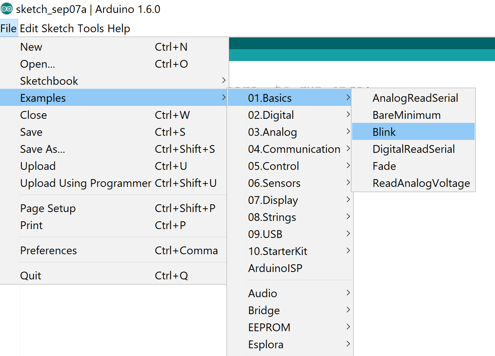
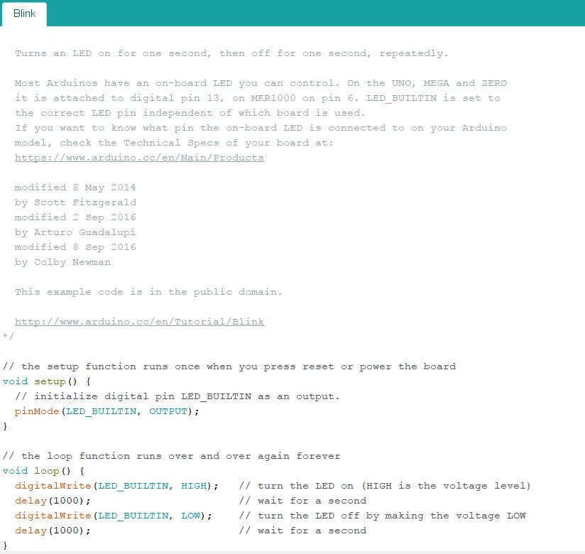
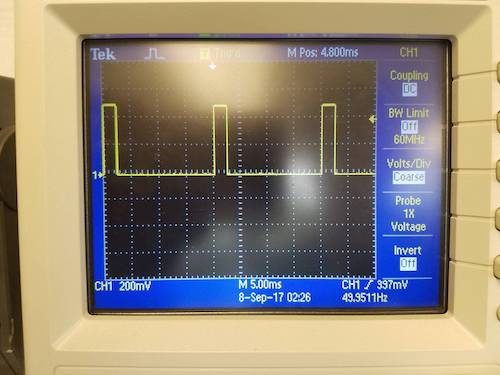
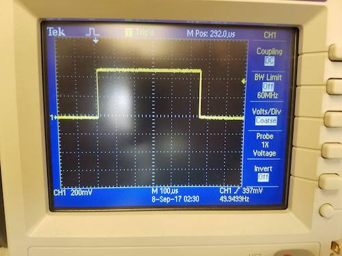
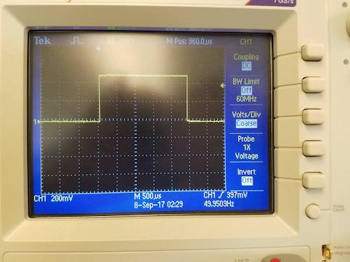
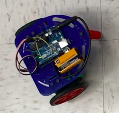

# Lab 1

## Premise
For the team to gain basic familiarity with the various features of the Arduino UNO and Arduino IDE; for the team to begin preliminary construction of the robot.

## Required Materials
- 1 Arduino Uno
- 1 USB A/B cable
- 2 Continuous rotation servos
- 1 LED
- 1 Potentiometer
- Electrical Tape
- Soldering Iron
- Shrink Wrap
- Several resistors
- At least one in 330 Ohm range
- At least one in 10 kOhm range
- 1 Solderless Breadboard
- Handful solid-core wires
- Wire Stripper
- Various robot components
- 1 Chassis
- 2 Wheel trusses
- 2 Wheels (approx. 4’ diameter)
- 2 Rubber bands
- 8 Bolts (approx. 0.5’)
- 8 matching nuts
- 6 enthusiastic and cooperative comrades!

## Procedure

## Part 1: Modify the Blink Sketch
First and foremost, install the Arduino IDE from [here](https://www.arduino.cc/en/Main/Software).

The first part of the lab involves modifying the blink sketch -- provided by default in the Arduino IDE -- to blink an external LED. You can find the blink sketch in File > Examples > Basics > Blink (fig 0, fig 1).


> Figure 0. Opening blink sketch. 


> Figure 1. What blink sketch looks lke.

To blink an external LED, first declare a variable, ledPin, which stores a number between 0 and 11. This number will determine which pin outputs the the loop signal. In setup() and loop(), replace LED_BUILTIN with your variable, ledPin (fig. 2).


> Figure 2. Modified Blink Sketch. We chose 6 as our ledPin.

Connect the positive end of the LED to the pin specified in ledPin, and connect the negative end of the LED to ground. When wiring your circuit, remember to insert a 330 Ohm resistor in order to protect your Arduino from a short circuit! Compile and run the program. If everything went right, it should look something like this:


> Figure 3. Blinking LED on Arduino

[Here's a video!](https://drive.google.com/file/d/0B5FA_MhAcyNYMlNTUUlYcjlwR0k/view)


## Part 2: The Serial Monitor and the Analog Pins
In Part 2, we will connect a potentiometer to the Arduino and use the Serial Monitor to read the voltage difference. The datasheet for the potentiometer we used is [here](http://www.bourns.com/data/global/pdfs/3306.pdf).
	
When writing the Arduino code for Part 2, remember to use analog pins. The naming convention for analog pins is A#, with # representing any integer between 0 and 5 (fig. 3).

Similar to part 1, in the setup() portion of the code, declare variable pin to be an input. Additionally, add a serial monitor by including Serial.begin(9600). In the loop() portion of the code, print the voltage output from the potentiometer to the serial monitor by adding Serial.println(analogRead(pin)). Finally, add a 500 ms delay between print outputs using delay(500) between each println, so the screen will not be flooded with numbers. Set up should look like: 
```
//example global variable
int pin = A0;
//example set up
void setup() {
  pinMode(pin, INPUT);
  Serial.begin(9600);
}
//example loop
void loop() {
  Serial.println(analogRead(pin)); 
  delay(500); //in milliseconds!
}
```
> Figure 4. Analog with Potentiometer code. We chose A0 as our pin.

When wiring the circuit, connect the middle pin of the potentiometer to your analog pin specified in pin. Remember to add a 330 Ohm resistor between the Arduino’s analog pin and the potentiometer middle pin! Make a voltage divider by adding an approximately 10 kOhm resistor between the 3.3V port and the potentiometer bottom pin. The potentiometer top pin will connect to GND. When running the program, twist the potentiometer clockwise and counterclockwise and observe the changing readouts. It should look something like this:


> Figure 5. Voltage Divider using Potentiometer and 1K Resistor

[Check out our video!](https://drive.google.com/file/d/0B5FA_MhAcyNYY2t1RjZvcjRuUW8/view)


> Figure 6. LED Brightness Oscilloscope Waveform 


> Figure 7. Reading analog voltage created by voltage divider

## Part 3: Analog Output
In this part of the lab we were able to overcome the Arduino’s inability to create analog outputs by using a pulse-width modulator (PWM). In order to do this, the output must be connected to a digital output pin on the board that supports PWM. Essentially the same code can be used as the previous part with the potentiometer except the function analogWrite is included to convert the signal to analog form. Then the potentiometer must be mapped to the value for the LED’s brightness. The potentiometer is then able to be used as an analog input to change the brightness of the external LED.


> Figure 8. Controlling LED Brightness using Voltage Divider

[Potentiometer and LED Circuit Video](https://drive.google.com/file/d/0ByhHNtu8Ya5JQ0pva09HQzFiNk0/view?pli=1)


## Part 4: Parallax Servos
This part of the lab will control the direction and speed of the Parallax Continuous Rotation Servo using the voltage divider and potentiometer made in part 2. Connect the servo to the Arduino Uno by hooking up the white wire to digital pin 11 which has PWM capability, red wire to the 5V output pin, and black wire to GND. The PWM frequency is 49.5Hz, minimum duty cycle is 2.75% and maximum duty cycle is 12.5%.


> Figure 9. Frequency is 49.5Hz


> Figure 10. Duty Cycle is 2.75% when 0 written to Servo


> Figure 11. Duty Cycle is 7.5% when 90 written to Servo


> Figure 12. Duty Cycle is 12.5% when 180 written to Servo

Insert the code below into your Arduino IDE. The Servo.h library provides functions which make communication with servo simpler. A0 analogRead is used to translate the voltage from the voltage divider into a digital value ranging from 850 to 950. This 850 to 950 range was determine through trial and error to be best for control of servo speed. To visualize the voltage in this 850:950 range, (digital value 850:950) * 5V / 1024 = (analog voltage). The map() function provided by the Servo.h library maps the range 850:950 to range 0:180 and val takes on the new value generated. Warning: the map() function uses integer math and fractional remainders are truncated, so precision is reduced. val is then transmitted to the servo through the s.write function provided by the Servo.h library. The function s.write converts val into a PWM signal, and the servo decodes the pwm using it’s ICs to control its shaft speed and direction. When val=90, servo rotates at 0 rpm; when val is increased from 90 to 180, servo increases speed in CCW direction; when val is decreased from 90 to 0, servo increases speed in CW direction. Further, the servo has a calibration potentiometer right above the place where the cable attaches to the case. This calibration potentiometer must be adjusted until s.write(90) corresponds to 0 rpm. The delay of 10ms provides enough reaction time between the potentiometer being adjusted and the servo changing speed/direction.

	// Controlling servo speed and direction
	#include <Servo.h>
	//configure pins; protective resistor = 326 ohms; resistor in series w/ Vcc = 4.64 kohms
	int PIN = A0;
	int val = 0;
	Servo s;

	void setup() {
	  pinMode(PIN, INPUT);    // Set pin A0 as input
	  s.attach(11);           // Set pin 11 as Servo PWM control
	  Serial.begin(9600);     // Serial displays what mapping does
	}

	void loop() {
	  val = analogRead(PIN);            // analog voltage read from voltage divider
	  Serial.print("analogRead: ");
	  Serial.print(val);
	  // A value between the range of 850:950 is mapped to a value in range of 0:180
	  val = map(val, 850, 950, 0, 180);
	  Serial.print(" mapped to: ");
	  Serial.println(val);
	  s.write(val);   // A value in range of 0:180 is transmitted to servo
	  delay(10);      // Sufficient delay for reaction time
	}
> Figure 13. Programming the servos. 
## Part 5: Assemble and Run Your Robot


> Figure 14. Assembled Robot

### Mechanical Assembly
To get the robot up and moving, its base must first be put together with the wheels and servos. First step is to stretch rubber bands around each of the circumferences of the two wheels to give them more grip. Attachments are then connected to each of the wheels using multiple screws and nuts that allow the wheels to then be attached to the servos. After each of the servos are connected to wheel trusses, the trusses are attached to the chassis.


> Figure 15. Wheels assembled

### Electrical Assembly
There are two Servos and one 5V pin on the Arduino. Each Servo consumes up to 50mA and 5V source on Arduino supplies more than 100mA. To power both motors, cut three-3” pieces of solid core wire, hold two together and solder their ends to one wire end as shown in the image, connect one wire to 5V and the other two to the red wire in the Servo connector.

Wrap electrical tape in a circle such that sticky side faces out, place this on bottom of Arduino Uno and attach Uno to top of chassis. Similarly, attach 9V battery using tape to top of chassis. Attach the battery strap to the 9V battery and connect the cable into the barrel connector.

### Software

#### Autonomous Square
After assembling the robot, insert the code below into your Arduino IDE and upload to the Arduino Uno. Disconnect the USB A/B cable and power the Uno from the 9V battery.

This code is commented to describe how it works. You will see the robot move forward for two seconds, the robot turns left for a little more than a second, then repeats these two steps over and over autonomously. The delay of 1157ms was determined by trial and error in getting the robot to turn precisely 90 degrees left.

	// Code for robot moving in a square
	#include <Servo.h>
	//configure pins; protective resistor = 326 ohms; resistor in series w/ Vcc = 4.64 kohms
	int val = 160;
	Servo left;
	Servo right;

	void setup() {
	  // put your setup code here, to run once:
	  left.attach(11);	// Set pin 11 as Left Servo PWM control
	  right.attach(10);	// Set pin 1o as Right Servo PWM control
	}

	// loop function for square
	void loop() {
	  //side of square
	  left.write(val);	// Turns left Servo CCW for forward motion of Robot
	  right.write(-val);	// Turns right Servo CW for forward motion of Robot
	  delay(2000);		// Forward motion for 2 seconds

	  //turn ninety degrees counter clockwise
	  left.write(90);		// Stop left Servo so Robot makes a left turn
	  delay(1157);		// Turn for 1157ms which corresponds to a right angle turn
	}
	
> Figure 16. Final code to move in a square

[Square Video](https://drive.google.com/file/d/0B4rO1v98kaZocnJaVWtVRl9NOWM/view)

#### Autonomous Figure 8

To move in a figure 8, the robot moves forward for two seconds, turns left for a little more than a second, then repeats these two steps over and over autonomously. The delay of 3775ms was determined by trial and error in getting the robot to turn enough to make a consistent-in-one-location.

	// Code for robot moving in a figure 8
	#include <Servo.h>
	//configure pins; protective resistor = 326 ohms; resistor in series w/ Vcc = 4.64 kohms
	int val = 160;
	Servo left;
	Servo right;

	void setup() {
	  // put your setup code here, to run once:
	  left.attach(11);	// Set pin 11 as Left Servo PWM control
	  right.attach(10);	// Set pin 1o as Right Servo PWM control
	}

	//loop function for figure 8
	void loop(){
	  //spin CCW
	  right.write(-val);	// Turns right Servo CW
	  left.write(90);		// Sets left Servo to 0 rpm
	  delay(3775);		// Turn for 3775ms

	  //go forward a little
	  right.write(-val);	// Turns right Servo CW for forward motion of Robot
	  left.write(val);	// Turns left Servo CCW for forward motion of Robot
	  delay(450);		// Move forward for 450ms

	  //spin CW
	  right.write(90);	// Sets right Servo to 0 rpm
	  left.write(val);	// Turns left Servo CCW
	  delay(3775);  	// Turn for 3775ms

	  //go forward a little
	  right.write(-val);	// Turns right Servo CW for forward motion of Robot
	  left.write(val);	// Turns left Servo CCW for forward motion of Robot
	  delay(450);		// Move forward for 450ms
	}
	
> Figure 17. Final code to move in figure 8.

[Figure 8 Video](https://drive.google.com/file/d/0B4rO1v98kaZoQmJuSW9ZVUpJYVE/view)
