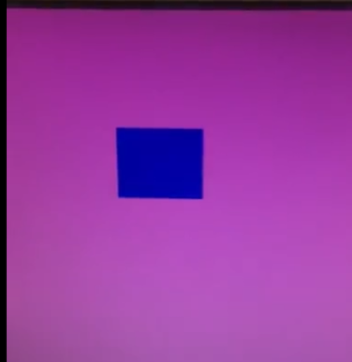
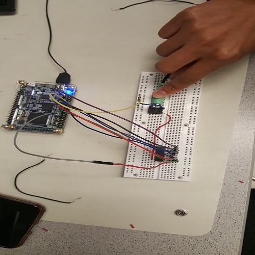
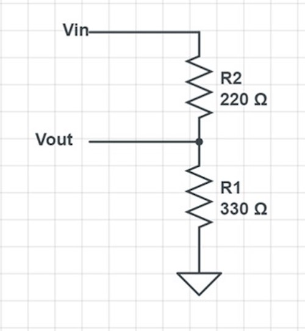

# Goal

In this lab, we will configure an FPGA to be able draw on a screen and send a “done” tune to the speaker. This will be implemented in the final system since we will need to map the robot’s path and know when it has finished traversing every square.

# Graphics

## DAC 

Each of the 3 RGB ports takes in analog input of 0-1V. FPGA outputs 3.3 V max, as seen in from this [link.](http://valhalla.altium.com/Learning-Guides/CR0113%20VGA%20-%208-bit%20VGA%20Controller.pdf)

From the arrangement of the resistors, we can see that it is a simple binary DAC. Using the example in the datasheet and information provided from the lab 3 instructions, the red cable takes 3 bits of input (the first left 3 resistors), the green takes 3 bits (the next three resistors), and the blue takes 2 bits (the last two right resistors). We can confirm the binary relationship between the resistors and the color bit sizes by measuring the resistances from left to right: 

	269, 604, 1183 (red), 268, 605, 1186 (green), 178, 468 (blue) 

The 50 ohm internal resistance of the VGA creates a voltage divider with the 8 external resistors.

Red equivalent resistance at highest input value: 1 / ((1/286)+(1/604)+(1/1128))= 166 ohms

3.3 * 50 / (50 + 166) = 0.764 V

Green equivalent resistance at highest input value: 1 / ((1/286)+(1/605)+(1/1186))= 167 ohms

3.3 * 50 / (50 + 167) = 0.760 V

Blue equivalent resistance at highest input value: 1 / ((1/178)+(1/468))= 129 ohms

3.3 * 50 / (50 + 129) = 0.922 V

These three voltage values are above 0.75 V and under 1 V, so they fall in the range of the 111 input value. The same method applies to the green and blue inputs.

The three bits for each color can vary resulting in lower output voltages and in many different combinations for colors. There are 8 shades of red, 8 shades of green, and 4 shades of blue. This results in 256 shades of mixed RGB color per a pixel. The vga display adjusts its color with absense of a color at 0v and strongest color at max voltage.

## Drawing on the Screen

Before we begin the explanation of drawing the screen, there is some preliminary information to cover.

There are two modules provided by the template code: the DE0_NANO module and the VGA_DRIVER module. The DE0_NANO module is the main module, responsible for providing a color given a specific pixel. The VGA_DRIVER iterates through every pixel on the monitor, providing these pixels to the DE0_NANO module. Once the VGA_DRIVER receives a color from the DE0_NANO module, it outputs a pixel of that color onto the screen.

The color that is output to the screen is determined by an 8-bit binary number, separated into three sections; three bits represent red, three bits represent green, and two bits represent blue. For instance, given the following signal:

> 8’b001_100_10
	
red is set to the value 3’b001, green is set to the value 3’b100, and blue is set to the value 2’b10.

The FPGA is connected to the monitor through a VGA switch which connects to the FPGA through a VGA connector and uses the resistances calculated in the DAC section. The template program uses odd-numbered GPIO-0 pins between 9 and 23 to output color to the screen. Figure 1 shows the pinout of the FPGA.


>Figure 1: pinout diagram of the DEO_nano FPGA board. Pins used for color are highlighted.

We started by changing the color on the screen. To do this, in DE0_NANO we set the PIXEL_COLOR value to 8'b101_010_11, a pinkish color, in the always@(posedge CLOCK_25) block. 

In the always@(posedge CLOCK_25) block, we then created a 2x2 grid on the VGA monitor and changed the color for the top left block. Each block is 60 pixels wide and 60 pixels tall, and the center of the first block (top left) is at (60, 60). To color the top left block, if the pixel coordinates have values between 30 to 90, those pixels will be colored blue (8'b000_001_11). 

After getting familiar with displaying colors on the VGA monitor, we connected two toggle inputs to move the block in the X- and Y- directions on the screen. The 2x2 array we created corresponds to the block’s location. If the array element (Array[x][y]) is 0, the block at that corresponding location (see Figure 2) would be the same color as the background, pink. If the element is 1, the block appears as blue. The x-index of the array is toggled by grounding the GPIO_0_D[31] pin, and the y-index of the array is toggled by grounding the GPIO_0_D[33] pin. The array element itself represents whether or not the blue block appears.


>Figure 2. 2x2 Grid and array indices.


>Figure 3. Display of grid with one colored block and the rest as background.

To constantly update the location of the block, we used one case statement so only one block would be colored blue at a time and PositionX and PositionY inputs would be concatenated and evaluated concurrently. We also set the block at the previous location to be the color of the background, to ensure the block’s location is constantly updated.

```
always @(posedge CLOCK_25) begin

 PositionX = GPIO_0_D[31]; // True if +X, False is -X
 PositionY = GPIO_0_D[33]; // True if +Y, False is -Y
 PositionXandY = {PositionX, PositionY};
	case(PositionXandY)
		2'b00: begin
		Array[x][y] = 1'b0;
		x = x*1'b0;
		y = y*1'b0;
		Array[x][y] = 1'b1; end
		2'b01: begin
		Array[x][y] = 1'b0;
		x = x*1'b0;
		x = x+1'b1;
		y=y*1'b0;
		Array[x][y] = 1'b1; end
		2'b10: begin
		Array[x][y] = 1'b0;
		x = x*1'b0;
		y = y*1'b0;
		y = y + 1'b1;
		Array[x][y] = 1'b1; end
		2'b11: begin
		Array[x][y] = 1'b0;
		x = x*1'b0;
		x = x + 1'b1;
		y = y*1'b0;
		y = y + 1'b1;
		Array[x][y] = 1'b1; end
		default: Array[x][y] = 1'b1;
	endcase
	
	if (PIXEL_COORD_X > (10'd60-10'd30) && PIXEL_COORD_X < (10'd60+10'd30) && PIXEL_COORD_Y > (10'd60-10'd30) && PIXEL_COORD_Y < (10'd60+10'd30)) begin
		if(Array[1'd0][1'd0])begin
		PIXEL_COLOR = 8'b000_001_11; end
		else begin
		PIXEL_COLOR = 8'b101_010_11; end
		// 
	end
	// (0,1)
	else if (PIXEL_COORD_X > (10'd60-10'd30) && PIXEL_COORD_X < (10'd60+10'd30) && PIXEL_COORD_Y > (10'd60*2-10'd30) && PIXEL_COORD_Y < (10'd60*2+10'd30)) begin
		if(Array[1'd0][1'd1])begin
		PIXEL_COLOR = 8'b000_001_11; end
		else begin
		PIXEL_COLOR = 8'b101_010_11; end
	end
	// (1,0)
	else if (PIXEL_COORD_X > (10'd60*2-10'd30) && PIXEL_COORD_X < (10'd60*2+10'd30) && PIXEL_COORD_Y > (10'd60-10'd30) && PIXEL_COORD_Y < (10'd60+10'd30)) begin
		if(Array[1'd1][1'd0])begin
		PIXEL_COLOR = 8'b000_001_11; end
		else begin
		PIXEL_COLOR = 8'b101_010_11; end
	end
	// (1,1)
	else if (PIXEL_COORD_X > (10'd60*2-10'd30) && PIXEL_COORD_X < (10'd60*2+10'd30) && PIXEL_COORD_Y > (10'd60*2-10'd30) && PIXEL_COORD_Y < (10'd60*2+10'd30)) begin
		if(Array[1'd1][1'd1])begin
		PIXEL_COLOR = 8'b000_001_11; end
		else begin
		PIXEL_COLOR = 8'b101_010_11; end 
	end
	
	else begin
		PIXEL_COLOR = 8'b101_010_11;
	end
	
end
```
>Figure 4. Code snippet of toggle-input case statement.

You can see a video of the blocks moving with toggled inputs [here](https://youtu.be/ciE7AULMfPA)! 

# Acoustics

## Overview of port declarations and initializations

To declare variables in Verilog, we use input, output, registers and wires. Input and output define the variable as something that will come in and something that will go out, respectively. Registers are used to store information (such as state variables), and wires literally behave as simple wires with arbitrary width. Follow [these rules](https://inst.eecs.berkeley.edu/~cs150/Documents/Nets.pdf)  to use them correctly!

To initialize pins on the FPGA, we use the default pin registers (GPIO_0_D) that initializes all the pins as inputs and outputs (use inout). 

At the top, all inputs and outputs are initialized in a module declaration. For example:

``` 
module example(
	Clock,
	GPIO_0_D,
	test_variable);
```

## Square Wave

To generate a square wave, we used a simple two-state state machine with an decrementing counter that outputs a 440 Hz or 0 Hz tone based on the counter value. To determine the counter value, we used the following steps:
The state machine is clocked at 25 MHz and the period of the wave is 440 Hz, so the total number of clock cycles per wave cycle must be: 25MHz/440Hz = 56818 cycles.

The square wave is essentially a toggle from 0 to 1, so the total number of toggles must be #cycles/2. Therefore, the wave should toggle approximately every 28409 cycles, and the value of counter should be instantiated as this value.

Within our state machine, we first check if our counter is equal to 0; if the counter is 0, then we toggle the square wave (a binary 1 or 0 that is assigned to an output register). If the counter is not zero, then the square wave toggle bit should retain its value and decrement the counter by 1. 

To test if we were generating a correct wave at the correct frequency, we tested on the oscilloscope as well as with a speaker. This is what the wave should look like: 


>Figure 5. Square wave at 440 Hz. 

## Triangle Wave

To generate a triangle wave, we followed similar logic as the square wave, but the state machine was a little more complex, and we used an [8-bit R2R DAC](http://www.bourns.com/docs/Product-Datasheets/R2R.pdf) to convert an 8 bit digital output to analog voltages. 



>Figure 6. Set up with 8 bit DAC.

Unlike a square wave which toggles, a triangle wave ramps up and down in one cycle (from 0 to 255 and back down). As a result, we had two counters:
1) Counter: Kept track of the number of CPU cycles that must pass until the next wave is generated. We calculated this by taking 	the total number of CPU cycles for toggling (calculated above) by 255 (one ramp). This gives us approximately 110 cycles. 
2) Counter2: This was used to keep track of our count up and count down. When counter is 110, we check the value of counter 2 and output the respective value to the FPGA. The range of this counter was 0 to 509 (255 * 2 to account for a ramp up and down). 
 


>Figure 7. Triangle wave at 440 Hz. 

## Three-frequency tune

The program used to generate three distinct frequencies is divided into two modules: makeTone and DE0_NANO2. makeTone uses the same structure as the program used to generate a single frequency tone as described above.

DE0_NANO2 is at the top of our project’s hierarchy, it controls which frequency is played and contains the logic to detect a sound enable signal. The module uses two additional variables to keep track of the sound: tone_duration_counter tracks how long the current tone has played and tone_number_counter tracks which frequency is being played. The always block of the module contains an if-else branch that decides which tone to play based on the value tone_number_counter. The logic for the three tones in the if-elseif branches is as follows:

	Enable sound
	Set frequency of tone to be played
	Calculate clock cycles to play this frequency 
	If tone has played for one second{
		Reset tone duration counter
		Switch to next tone
	}
	Else{
		Keep playing current tone, increment tone duration counter
	}

Additionally, there is an else branch in DE0_NANO2 that disables the sound and resets the tone counter to the first one so that the tune can loop. 

Since the tone’s frequency changes, we have to do some additional calculation to determine 1) how many cycles the triangle wave should take to go from 0 to 255 and back to 0 and 2) how often to increment the wave output value to meet the timing requirement of 1. Here’s the math:

Cycles to go from 0->255->0, stored in variable “CLKDIVIDER”
		CLKDIVIDER = state machine clock speed / desired frequency / 2
For 440 Hz	CLKDIVIDER = 25 MHz / 440 Hz/ 2
		CLKDIVIDER = 28409

Cycles to determine how often to increment wave output by 1, stored in variable “cycles “
		cycles = CLKDIVIDER / number of steps
		cycles = CLKDIVIDER / 256				256 steps for 0 to 255
For 440 Hz	cycles = 28409 / 256
		cycles = 110

These values match the code for the single tone 440 Hz triangle wave. CLKDIVIDER is calculated in each if/elseif statement in DE0_NANO2 and then passed as an input to makeTone to calculate cycles. These values determine how quickly the wave steps from 0 to 255 and therefore generate the difference in sound. Here the difference in this video of our three tone tune, readings from the oscilloscope also show the different frequencies. The frequency being played is shown in the bottom right hand corner. [Here's a video of what it shuold look like.](https://youtu.be/L3GszLX1wvM)

## Enable tone with Arduino

In order to toggle the tune that we created on and off, we introduced an enable signal that comes from the Arduino. The signal outputs from one of the digital pins on the Arduino and inputs to one of the default pins on the FPGA - in this case we used pin 18. Since a logic high signal coming from the Arduino is 5V and a logic high input for the FPGA must be 3.3V, we had to create a voltage divider circuit to scale the signal coming from the Arduino. To make this circuit we placed two resistors in series with resistances of 330 Ohms and 220 Ohms. 



> Figure 8. Voltage divider circuitry. 


>Figure 9. Block diagram of our pins and circuitry.

To test the enable signal, we created a simple Arduino Uno program that tells the digital pin to output a logic high for three seconds and then a logic low for one second. In makeTone we added a conditional statement within the always block:

```
If pin GPIO_0_D_18 receives a logic high signal from Arduino{
	Increment counters
Play current tone
}
Else{
	Stop playing the current tone
	Reset all counters 
}

```

With the enable implemented we can now turn the tune on/off with a simple enable signal coming from the Arduino. In [this video](https://www.youtube.com/watch?v=aGEa08fkF8c), the top channel shows the output of the Arduino (the enable signal) and the other channel shows the three tone triangle wave.


```
//=======================================================
// ECE3400 Fall 2017
// Lab 3: Template top-level module
//
// Top-level skeleton from Terasic
// Modified by Claire Chen for ECE3400 Fall 2017
//=======================================================
`define ONE_SEC 25000000
module DE0_NANO(
 //////////// CLOCK //////////
 CLOCK_50,
 //////////// GPIO_0, GPIO_0 connect to GPIO Default //////////
 GPIO_0_D,
 GPIO_0_IN,
 CLKDIVIDER_440
);
  //=======================================================
  //  PARAMETER declarations
  //=======================================================
  localparam ONE_SEC = 25000000; // one second in 25MHz clock cycles
 
  //=======================================================
  //  PORT declarations
  //=======================================================
  //////////// CLOCK //////////
  input         	  CLOCK_50;
  //////////// GPIO_0, GPIO_0 connect to GPIO Default //////////
  inout   	[33:0]  GPIO_0_D;
  input    	[1:0]  GPIO_0_IN;

 reg [8:0] sound_val; 
  
  //local parameter
 input CLKDIVIDER_440; 
 //sound variable
 reg     	CLOCK_25;
 
 //reg [7:0] square_440;
 
 assign GPIO_0_D[2] = sound_val[0]; //sound_freq[0]
 assign GPIO_0_D[4] = sound_val[1];
 assign GPIO_0_D[6] = sound_val[2];
 assign GPIO_0_D[8] = sound_val[3];
 assign GPIO_0_D[10] = sound_val[4];
 assign GPIO_0_D[12] = sound_val[5];
 assign GPIO_0_D[14] = sound_val[6];
 assign GPIO_0_D[16] = sound_val[7];
 reg[15:0] counter;
 reg[15:0] counter2; 
 //reg[8:0] cycle = CLKDIVIDER_440/256/2;
  // Generate 25MHz clock for VGA, FPGA has 50 MHz clock
	always @ (posedge CLOCK_50) begin
    	CLOCK_25 <= ~CLOCK_25;
	end // always @ (posedge CLOCK_50) 

 

 
//sound state machine
always @(posedge CLOCK_25) begin

 

if(counter < 110 && counter >= 0) begin 
	counter <= counter + 1;
 
 end
 
 else begin
	
 if (counter2 == 0) begin
  counter2 <= counter2 + 1;
  sound_val <= sound_val + 1;
  counter <= 0; 
 end
 
 else if(counter2 <= 254) begin
  counter2 <= counter2 + 1;
  sound_val <= sound_val + 1;
  counter <= 0; 
 end
 
 else if(counter2 < 509) begin 
	counter2 <= counter2 + 1;
	sound_val <= sound_val - 1; 
	counter <= 0; 
 end
 
 else begin
	counter2 <= 0; 
	sound_val <= 0; 
	counter <= 0; 
 end
 
 end
 
end

 
endmodule 


///////////////////////////
/*module DE0_NANO
(
  input [9:0] addr,
  input clk, 
  output reg [7:0] q
);

  // Declare the ROM variable
  reg [7:0] sine[628:0];

  initial
  begin
     sine[0] <= 8'b10000000;
     //... remaining contents of sine table//
     sine[628] <= 8'b10000000;
  end

  // Read from requested address of ROM
  always @ (posedge clk) begin
    q <= sine[addr];
  end
  
 endmodule */
```


```
module makeTone(
	reset,
	CLKDIVIDER,
	GPIO_0_D,
	//sound_val,
	CLOCK_50
); 

//=======================================================
  //  PARAMETER declarations
  //=======================================================
  localparam ONE_SEC = 25000000; // one second in 25MHz clock cycles
 
  //=======================================================
  //  PORT declarations
  //=======================================================
  //////////// CLOCK //////////
  inout [33:0] GPIO_0_D;
  input reset; 
  input CLOCK_50;
  input [31:0] CLKDIVIDER; 
  
  reg [8:0] sound_val; 
  reg enable_sound = 1'b1;
  reg tone_duration_counter = 0; 
  reg tone_number_counter = 2'b0; 
  reg [2:0] SW; 

  
 //sound variable
 reg     	CLOCK_25;

 assign GPIO_0_D[2] = sound_val[0]; //sound_freq[0]
 assign GPIO_0_D[4] = sound_val[1];
 assign GPIO_0_D[6] = sound_val[2];
 assign GPIO_0_D[8] = sound_val[3];
 assign GPIO_0_D[10] = sound_val[4];
 assign GPIO_0_D[12] = sound_val[5];
 assign GPIO_0_D[14] = sound_val[6];
 assign GPIO_0_D[16] = sound_val[7];
 reg[15:0] counter;
 reg[15:0] counter2; 
 reg[31:0] cycle;
 assign cycle = CLKDIVIDER/256;
 
  // Generate 25MHz clock for VGA, FPGA has 50 MHz clock
	always @ (posedge CLOCK_50) begin
    	CLOCK_25 <= ~CLOCK_25;
	end // always @ (posedge CLOCK_50) 

//sound state machine
always @(posedge CLOCK_25) begin

if(GPIO_0_D[18] == 1'b1) begin

	if(counter < cycle && counter >= 0) begin 
		counter <= counter + 1;
 
	end
	
	else begin
	
		if (counter2 == 0) begin
			counter2 <= counter2 + 1;
			sound_val <= sound_val + 1;
			counter <= 0; 
		end
 
		 else if(counter2 <= 254) begin
		  counter2 <= counter2 + 1;
		  sound_val <= sound_val + 1;
		  counter <= 0; 
		 end
 
		 else if(counter2 < 509) begin 
			counter2 <= counter2 + 1;
			sound_val <= sound_val - 1; 
			counter <= 0; 
		 end
 
		 else begin
			counter2 <= 0; 
			sound_val <= 0; 
			counter <= 0; 
		 end
 
	end
 
 end
 
 else begin
	counter2 <= 0; 
	sound_val <= 0; 
	counter <= 0; 
 end
 
end

 
endmodule 
```
