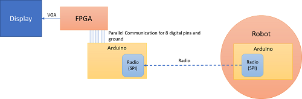
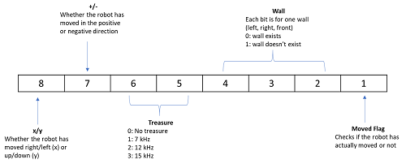
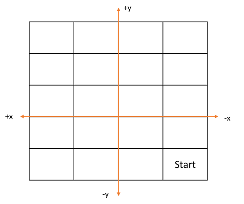
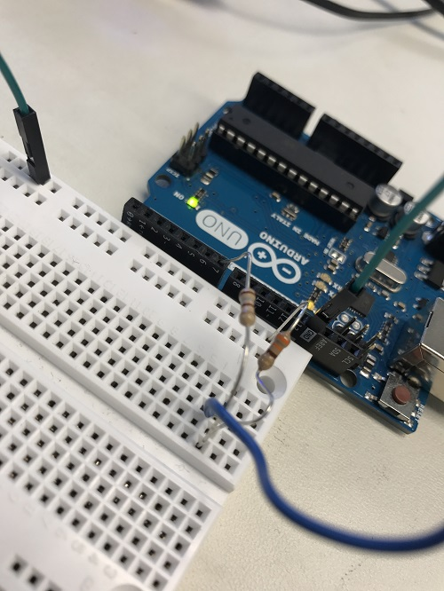
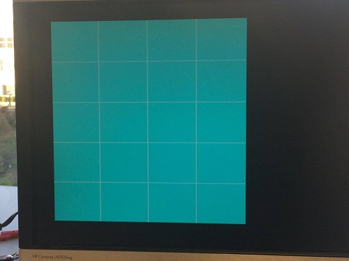
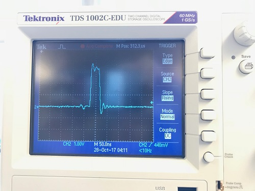
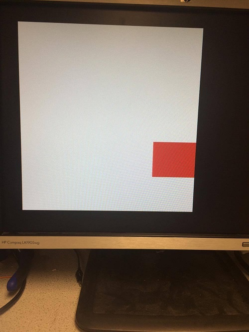

# Lab 4: Objective

The objective of this lab was to integrate radio communication from our robot to our base station and be able to display the robot’s movements in real time. 


>Figure 1. Block diagram of overall communication structure. 

# Communication Method

To communicate between our radios and arduino, we chose to use [_Serial Peripheral Interface_](https://embeddedmicro.com/tutorials/mojo/serial-peripheral-interface-spi) because it is faster than parallel communication between the hardware, allows us to send up to one byte of data and requires minimal set up. 

To communicate between the arduino and the base station, we chose to use parallel communication because it was easier to implement and handle in Verilog. 

Each packet of data that we send had the following structure: 


>Figure 2. Breakdown of packet structure. 

To update our location, we decided that we would only update whether or not the robot has moved in the positive or negative x or y direction. The Manhattan Grid like structure of the maze enables us to do this because in one step, the robot can only move in the x or y direction. Additionally, the moved flag will help us check if the robot has actually updated it’s location or not. We define our positive/negative x and y axis based on the starting point on the maze:


>Figure 3. Breakdown of axis and 5x4 grid. 


Note that these directions are relative to the robot’s movements. For example, in the first iteration, if the robot moves one step forward in the y direction, our bit values would be 11 (positive, y). Then, if the robot moves to the left by one, our bit values would be 10 (positive, x). If the robot moves down one, then our values would be 01 (negative, y), and so on.

# Radio

## Setting up the radios
First, we downloaded the RF24 Arduino library and the Getting Started code. In terms of hardware, we acquired two radio transceivers and attached them to separate radio breakout headers. The headers connect to arduino digital pins 9 through 13, with a separate wire connecting to the 3.3v power source and one pin connecting to GND.

According to the formula given in the lab handout, our team’s radio identifier numbers are 54 and 55, or 36 and 37 in hexadecimal. We then inserted these values into the radio’s two pipe addresses as follows:

```
// Radio pipe addresses for the 2 nodes to communicate.
const uint64_t pipes[2] = { 0x0000000036LL, 0x0000000037LL };
```

By default, the Getting Started code outputs the current time every 250 milliseconds. The radio can be switched to transmit mode by pressing T, or switched to receive mode by pressing R. We connected the two radios to two separate laptops, set one to transmit and one to receive, and observed the results.

Upon closer examination of the Getting Started code, we found the segments of code responsible for transmitting data:

```
  if (role == role_ping_out)
  {
    // First, stop listening so we can talk.
    radio.stopListening();

    // Take the time, and send it.  This will block until complete
    unsigned long time = millis();
    printf("Now sending %lu...",time);
    bool ok = radio.write( &time, sizeof(unsigned long) );
    
    if (ok)
      printf("ok...");
    else
      printf("failed.\n\r");

    // Now, continue listening
    radio.startListening();
```
The next objective is to edit the code to change the time output into an character array output.

## Sending the entire maze
To send information about the entire maze, we created a 2-dimensional array to store the elements of the maze. We also created two integer variables to keep track of the indices of the element being sent. These x and y coordinates, represented by i and j, are updated in the loop function to ensure that the packets of information are sent at the same rate that the receiving end processes it. If a for loop was implemented within the loop function, this would cause inconsistent timing with the receiving end.

```
bool ok;
int i =0;
int j =0;
 unsigned char maze[5][4] = { 1, 2, 3, 4,
                                  5, 6, 7, 8,
                                  9, 10, 11, 12, 
                                  13, 14, 15, 16, 
                                  17, 18, 19, 20
                                  };

  if(j==4){    //radio sends one element of array each time
       j=0;
       if(i == 4)
        i=0;
       else{
        i++;
       }
   }
        printf("Now sending %lu...",&maze[i][j]);
        ok = radio.write( &maze[i][j], sizeof(unsigned char) );
        j++;
```

## Sending maze information
To save time, energy, and have ability to provide more information on one box in the maze, we wrote code to only send new information. We send a string of 8-bits shown in figure x which has a flag bit telling whether the robot has moved. If the flag bit is 0, the arduino on the receiving end does not process the information. If the flag bit is 1, the receiving arduino parses the 8-bit string to update the robot’s new position, whether there are treasures, and location of walls. The transmitting arduino only sends one 8-bit string with the flag bit as 1. If it were to send it twice, the receiving arduino would think the robot moved twice.

```
if (sent) { // Only send data with “flag bit true” once
  sent = 0;
  
// Variables hard coded for example. These will be dynamically changed later on.
Direction = B1;
xory = B1;
treasure = B10;
wall = B101;
moved = B1;
}
else { // Only send data with “flag bit true” once
  moved = B0;
}

// Combine the bits into an 8-bit string
data_transmit = xory<<7 | Direction<<6 | treasure<<4 | wall<<1 | moved;
   
        printf("Now sending %d...",data_transmit);
        ok = radio.write( data_transmit, sizeof(unsigned char) );
```
[_Here’s a video!_](https://youtu.be/hgYxBadniSU )


## Receive packets from radio

To receive packets from the radio on the robot, we used the same ping in/ping out configuration. However, before confirming that a packet was sent, the arduino on the base station receives an 8 bit packet via SPI from the radio. For example: 

```
if ( role == role_pong_back )
  {
    // if there is data ready
    if ( radio.available() )
    {
      // Dump the payloads until we've gotten everything
      unsigned long got_info;
      bool done = false;
      while (!done)
      {
        // Fetch the payload, and see if this was the last one.
        done = radio.read( &got_info, sizeof(unsigned long) );
        //  printf("Got payload %d...",got_info);
        // Delay just a little bit to let the other unit
        // make the transition to receiver
        delay(20);
      }
      // First, stop listening so we can talk
      radio.stopListening();
      // Send the final one back.
      radio.write( &got_info, sizeof(unsigned long) );
      printf("Sent response.\n\r");
      // Now, resume listening so we catch the next packets.
      radio.startListening();
    }
  }

```

## Parse the packets and send to FPGA

In order to parse the packets, we extracted each bit from the 8 bit package with an if statement that AND’s the bit to extract with a 1. For example, to extract the first bit, our conditional was similar to this:

```
if(got_item & 10000000) 
	//write to FPGA
   else
	//write to FPGA
```

We had this setup for arduino digital pins 1-8. To write to the FPGA, we used parallel communication. First, we designed a voltage divider using a 330 ohm and 180 ohm resistor to drop the arduino’s 5 V to approximately 3.3 V. Then, we wired up each arduino pin to the voltage divider (we had 8 voltage dividers in total), and then wired each arduino pin to a respective FPGA pin. We mapped arduino pins 1-8 to pins to GPIO_1_32-GPIO_1_18. 


We connected digital pins 1-8 from the arduino to FPGA pins through voltage dividers (to reduce the voltage from 5.0 V to 3.3 V). Then, as we extracted each bit, we wrote the value to our digital pin to update on the FPGA for each pin as such:

```
if(got_item & 10000000) 
	digitalWrite(1,HIGH); //if bit is 1, logic High
   else
	digitalWrite(1,LOW);  //if bit is 0, logic Low
```


>Figure 4. Voltage divider from Arduino to FPGA.


When wiring, remember to connect common ground and if you use pin 0 or pin 1 on the arduino, make sure to not use the serial monitor when testing otherwise the transmit/receive function of the pins will be enabled and will cause issues in your display!  

# FPGA 


## Making the display grid larger

To make the display grid larger we decided to change the original code to get rid of the arrays from the lab 3 code and make one big 5x4 grid. We chose to give each box a width and height of 80 pixels. Therefore, the grid has a total width of 320 pixels and a height of 400 pixels. In order to make this grid, the pixels within a box of width to height ratio of 4:5 had to be turned to white. We did this by scanning through pixels 30 to 350 in the horizontal direction and pixels 30 to 430 in the vertical direction, and assigning the a pixel color of white within this range. All of the pixels outside of this range are assigned the color black. 

For creating this grid we used the following code:

```
always @(posedge CLOCK_25) begin 
	if ((PIXEL_COORD_X > 10'd30) && (PIXEL_COORD_X < 10'd350) && (PIXEL_COORD_Y > 10'd30) && (PIXEL_COORD_Y < 10'd430)) begin
		PIXEL_COLOR <= 8'b111_111_11;
	end
	else begin
		PIXEL_COLOR <= 8'b000_000_00;
	end
end 
```

This code is run every positive edge of the clock cycle. The conditional statement first checks if the current pixel’s x coordinate is within the range of pixels 30 to 350 and if it’s y coordinate is within the range of pixels 30 to 430. If it is, then the pixel color for this pixel is given the bit string 111_11_11 which assigns it the color white. If the pixel is not within the range of the grid, then its color is given the bit string 000_000_00 - the code for the color black. This is done to all of the pixels within the given range.

## Mark explored territory
We attempted to implement keeping track of previously explored territory using an array called visited. The array is of size 4x5 with each square of the array corresponding to a block on the grid. Whenever we visit a square and color it red, we also change the value visited to 1. Afterwards, we hard coded a series of if statements that checks each index of visited. If the square has been visited, then we assign the pixel color to pick. 

When we tested this, however, we found that all the blocks that we placed conditional statements for permanently were colored blue such that not even the moving red square was not visible. Here’s what we saw:


> Figure 6. Blue boxes mark explored territory.

We initially thought that this was an initialization issue, however, when we switched the conditionals the same issue was present.
## Update robot’s movements

To update the robot’s movements we used the least significant bit of the data to signify whether or not the robot has moved. The program executes such that whenever we see a rising edge on this bit (the bit goes from low to high) the robot will have moved and we should update its location on the grid. To keep track of this rising edge we create to registers to store the previous status of the robot (stationary or moving) and the current status. Then whenever the previous value was low and the current value was high we know that the robot moved. 

To test this, we set the output of a GPIO pin to the value of our current bit and previous bit and observed the output on the oscilloscope. For example, at the rising edge, the oscilloscope showed the following: 


>Figure 7. Output of a GPIO Pin

Additionally, the robot takes in two additional inputs from the arduino: one to indicate movement in the x or y direction and one for positive vs. negative direction. Two registers are used to update the current x and y coordinate of the robot with (0,0) corresponding to the bottom right corner of the maze.

For updating the robot’s movements we used the following code :
```
  always @(posedge CLOCK_25) begin
 // if robot moved, update x and y
  if (currmov == 1 && prevmov == 0) begin
  if (GPIO_1_D[30] == 1'b0) begin
   if (GPIO_1_D[32] == 1'b0) begin
    x <= x - 1;
   end
   else begin
    if(x == 3) begin
     x <= 0;
    end
     else begin
    x <= x + 1;
    end
   end
  end
  else begin
   if (GPIO_1_D[32] == 1'b0) begin
    y <= y - 1;
   end
   else begin
    if(y == 4) begin
     y <= 0;
    end
    else begin
     y <= y + 1;
    end
   end
  end 
 end
```
	
The code first checks whether the robot moved by checking the last bit in the data. Next, an if-else branch checks whether the first bit of the data received was high or low to determine if the robot is moving in the x or y direction. Within each branch is another if-else branch to check if the robot is moving in the positive or negative direction. If the robot is moving in the positive direction, an additional check is made to ensure we stay within the grid boundaries and resets the value to 0 if we have gone above the limits.

Once the x and y coordinate are updated with the robot’s current location, coloring the corresponding grid is simply a conditional statement in the always blocked used to create the grid.

Here’s the conditional we use, it checks if the pixel being updated by the VGA is within the x and y range of the block the robot is in and makes the pixel color red if it is.

```
if ((PIXEL_COORD_X >(10'd350 - 10'd80*(x+1))) && (PIXEL_COORD_X <(10'd350 - 10'd80*x)) && (PIXEL_COORD_Y >(10'd430 - 10'd80*(y+1))) && (PIXEL_COORD_Y <(10'd430 - 10'd80*y)))
	PIXEL_COLOR <= 8'b100_000_00; //red
end
```
 
Each time the robot moves, x and y change so only the current location will be red. [_Here’s a video_](https://youtu.be/V4v4A5UJDsY) showing the VGA output of our grid in addition to LEDs on the FPGA.
LEDs 1 to 3 show the value of y and LEDs 4 and 5 show the value of x.


> Figure 8. Current location marked by red box.


