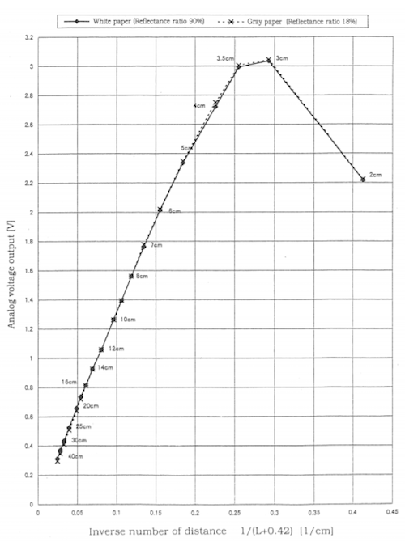
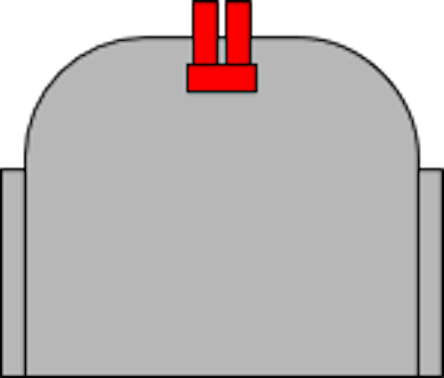
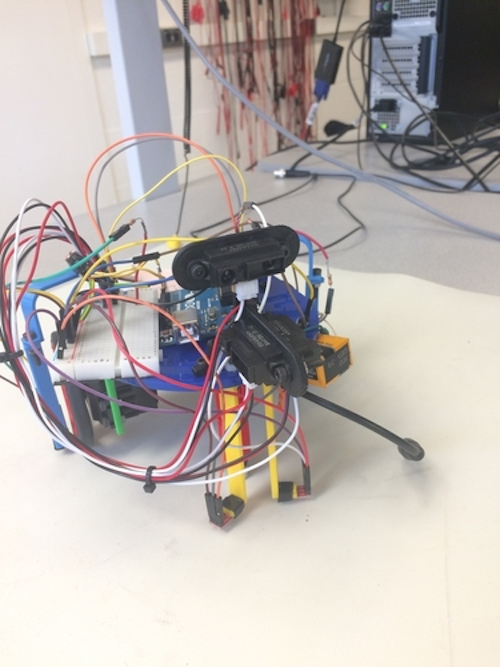
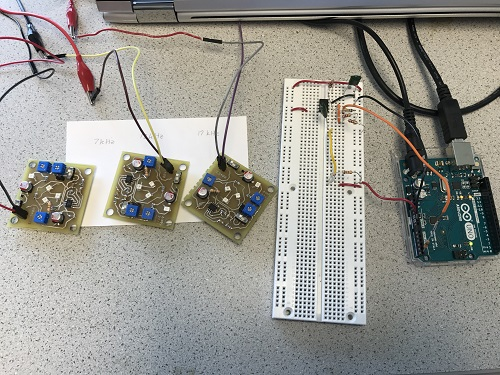
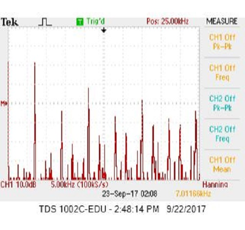
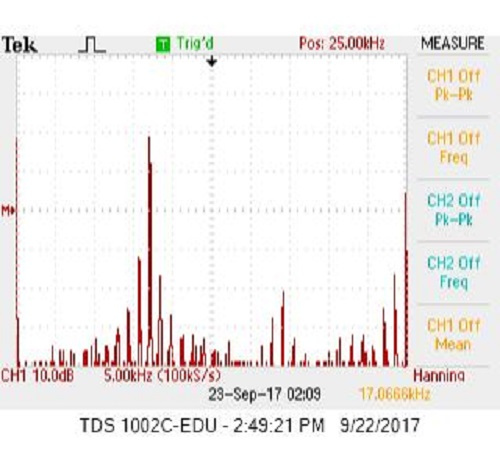

## Autonomous Wall Detection
### Preliminary Sensor Tests
Our first goal for milestone 2 was to have our robot autonomously detect walls using the [Sharp GP2Y0A41SK0F](http://www.sharp-world.com/products/device/lineup/data/pdf/datasheet/gp2y0a41sk_e.pdf) short-range IR sensors. These IR short-range IR sensors were chosen given the small distance of the walls to the robot. We attached three of these IR sensors to a 3D printed mount attached to the robot in order to detect walls in front, to the left, and to the right to aid in navigation through the maze.

We started off by connecting the IR sensor's GND, 5V, and analog signal output to the Arduino's GND, +5V, and analog input respectively.

The IR sensor readout produced an output which must be translated to voltage, then into distance. Based on the [datasheet](https://www.pololu.com/file/0J713/GP2Y0A41SK0F.pdf), in order to calculate a voltage, the following operations must be performed on the sensor readout:

```
volts = sensorValue*(5.0/1024.0);
distance = 11*(1/volts)-.42; //datasheet graph shows Voltage = slope*(1/distance)- slope calculated to be 11 using best fit line

```


> Figure 1. Graphical relationship between analog voltage and distance.
 
Next, we designed a custom distance sensor holder. Our group intends to place the distance sensors slightly ahead of the robot in order to allow the robot to begin the turn early.


> Figure 2. Schematic distance sensor holder.


> Figure 3. Placement of distance sensors on the robot. Distance sensors are colored red.


> Figure 4. Sensor configuration on the actual robot.

### Reading from 3 IR Sensors in Sequence
To continuously receive analog output from each of the three IR sensors without interference from the other two, we used the loop function to read from them one at a time.  

```
void loop() {
  if(i == 0)
    AX = A0;
  else if(i ==1)
    AX = A1;
  else
    AX = A2;
  // read the input on analog pin X:
  sensorValue = analogRead(AX);
```

>Figure 5. Sequentially reading from IR sensors in a repetitive loop


>Figure 6. Circuit for reading from 3 IR sensors

After cursory testing, we found that the distance sensors tend to occasionally give erroneous values. As such, we designed an outlier detection code. It takes the average of the previous three values and, if the current value is an outlier, then it disregards the value. If, however, the distance sensors read three outlier values in a row, then the previous distance value array will be reset.

```
 if (i+1 == 1)
  {
    s1_dist_avg = (s1_vals[0] + s1_vals[1] + s1_vals[2])/3;
    if (s1_dist_avg == 0) //If the system was just initialized, then set all array values to be the first measured distance.
    {
      s1_vals[0] = distance;
      s1_vals[1] = distance;
      s1_vals[2] = distance;
    }
    test_dist = distance - s1_dist_avg; //Documentation claims that it putting operations inside abs() will cause errors.
    if (abs(test_dist) <= 15)
    {
       s1_outliers = 0;
       s1_vals[s1_index] = distance;
       
       //Debugging print statements:
       /*Serial.print(distance);
       Serial.print(" has been put into s");
       Serial.print(i+1);
       Serial.print("_vals[");
       Serial.print(s1_index);
       Serial.print("].\n");*/
       if (distance > 40)  //Can be changed based on how far we want to detect walls.
       {
        Serial.println("No left wall detected!");
       }
       else
       {
        Serial.print("Left wall detected at distance ");
        Serial.println(distance);
       }
       if (s1_index < 2)
       {
        s1_index = s1_index + 1;
       }
       else
       {
        s1_index = 0;
       }
    }
    else
    {
      if (s1_outliers <= 2)
       {
        /*
        Serial.print("[OUTLIER NUMBER ");
        Serial.print(s1_outliers);
        Serial.println("]");
        */
        s1_outliers = s1_outliers + 1;
       }
       else
       {
        /*
        Serial.print("[3 IN A ROW DETECTED; RESETTING ARRAY WITH ");
        Serial.print(distance);
        Serial.println("]");
        */
        s1_outliers = 0;
        s1_vals[0] = distance;
        s1_vals[1] = distance;
        s1_vals[2] = distance;
        s1_index = 0;
       }
    }
  }
```
>Figure 6. Preliminary Outlier documentation code.

To test our code, we attached an LED to our circuit and made it flash a different number of times based on where the walls were detected. If the LED flashes 3 times, then the Arduino detects a wall to the left. If it flashes 2 times, then the Arduino detects a wall to the right. Finally, if there is a wall in front of the Arduino, the LED flashes once.

```
if (abs(test_dist) <= 15)
    {
       s1_outliers = 0;
       s1_vals[s1_index] = distance;
       
       //Debugging print statements:
       /*Serial.print(distance);
       Serial.print(" has been put into s");
       Serial.print(i+1);
       Serial.print("_vals[");
       Serial.print(s1_index);
       Serial.print("].\n");*/
       if (distance > 20)
       {
        Serial.println("No left wall detected!");
       }
       else
       {
        digitalWrite(ledPin, HIGH);   // LED blinks thrice when left wall detected
        delay(500);                       
        digitalWrite(ledPin, LOW);   
        delay(500);          
        digitalWrite(ledPin, HIGH);   
        delay(500);                       
        digitalWrite(ledPin, LOW);   
        delay(500);          
        digitalWrite(ledPin, HIGH);   
        delay(500);                       
        digitalWrite(ledPin, LOW);   
        delay(2000);          
        Serial.print("Left wall detected at distance ");
        Serial.println(distance);
       }
       if (s1_index < 2)
       {
        s1_index = s1_index + 1;
       }
       else
       {
        s1_index = 0;
       }
    }
```
>Figure 7. Left wall detected LED code. This segment replaces the if(abs(test_dist)<=15) block in Figure 6.

You can see this in action in this [video](https://youtu.be/2miRjfxZEqo).


## Optics - Software to Read Treasures 
To set up and test with the treasures, refer to the Optics Section of [Lab 2](https://cei-lab.github.io/ece3400/lab2.html). 

To determine the frequency of the treasure, we used the fft_adc_serial example from the Open Music Library (as described in Lab 2). Since we know from testing, that the maximum bin number for 7 kHz is 47, for 12 kHz is 78 and for 17 kHz is 118, we extracted the maximum FFT amplitude and bin number by looping over the logged data from the library. Here’s a snippet of the code: 

```
//extract and sort fft data to find max amplitude and bin 
    for (byte i = 2 ; i < FFT_N/2 ; i++) { 
      if(fft_log_out[i] > max_amp){
        max_amp = fft_log_out[i];
        max_bin = i;
      }
    }

```
> Figure 8. Here, max_amp and max_bin’s are of type int.  For every 2 bins from a group of 150 (FFT_N/2), if the value at fft_log_out[i] is greater than the current max_amplitude, then we store that value in max_amp and store the index of the loop, i, in max_bin.  

Then, we compare our calculated bin values to the actual maximum bin value using logical if-then statements. For each frequency, our range of detection was +/- 1. For example, for 7 kHz, we check if max_bin is greater than _or_ equal to 46 and if it is less than _or_ equal to 48. We do this to estimate our frequency, and to prevent the case in which the maximum bin number is not equal to 47. If the correct bin number is detected, the serial monitor will print the frequency. If no frequency is detected, the serial will print that no treasure is detected. 

These are our conditionals: 

```
 //7 khz
    if((max_bin >= 45) && (max_bin <= 47)){
      Serial.println("7 kHz Treasure detected");
    }

    //12 khz
    else if((max_bin >= 79) && (max_bin <= 81)){
      Serial.println("12 kHz Treasure detected");
    }
    
    //17 khz
    else if((max_bin >= 113) && (max_bin <= 115)){
      Serial.println("17 kHz Treasure detected");
    }
    
    //no treasure
    else{
      Serial.println("No Treasure detected");
    }

```
> Figure 9. Conditional statements to determine the correct treasure frequency as described above. 

### Testing Treasure Reading

We obtained three treasures, and tuned them to our target frequencies - 7 kHz, 12 kHz, 17 kHz - as described in [Lab 2](https://cei-lab.github.io/ece3400/lab2.html). Then, we wired each treasured to a power source at 3 V. The power source we used had 3 channels so we tested all three treasures at once, but you can also switch the treasures. The setup looked like this:


> Figure 10. Treasures tuned to 7 kHz, 12 kHz, 17 kHz, respectively. 


> Figure 11. Treasures tuned to 7 kHz, 12 kHz, 17 kHz with sensor. 

To confirm that each treasure is detected, we measured FFT peaks with the oscilloscope. The peaks for each treasure should look similar to the following diagrams:  


> Figure 12. FFT for 7 kHz.  


> Figure 13. FFT for 12 kHz.  


> Figure 14. FFT for 15 kHz.  

To test if our software itself works, we ran the Arduino serial monitor, and moved each treasure around the sensor. As the treasure was detected, the correct frequency was printed on the monitor. A video of the test can be found [here]( https://youtu.be/YcXYrebT4_M). 

The entirety of our code: 
```
/*
fft_adc_serial.pde
guest openmusiclabs.com 7.7.14
example sketch for testing the fft library.
it takes in data on ADC0 (Analog0) and processes them
with the fft. the data is sent out over the serial
port at 115.2kb.
*/

#define LOG_OUT 1 // use the log output function
#define FFT_N 256 // set to 256 point fft

#include <FFT.h> // include the library

void setup() {
  Serial.begin(115200); // use the serial port
  TIMSK0 = 0; // turn off timer0 for lower jitter
  ADCSRA = 0xe5; // set the adc to free running mode
  ADMUX = 0x45; // use adc5
  DIDR0 = 0x01; // turn off the digital input for adc0
}

void loop() {
  while(1) { // reduces jitter
    cli();  // UDRE interrupt slows this way down on arduino1.0
    for (int i = 0 ; i < 512 ; i += 2) { // save 256 samples
      while(!(ADCSRA & 0x10)); // wait for adc to be ready
      ADCSRA = 0xf5; // restart adc
      byte m = ADCL; // fetch adc data
      byte j = ADCH;
      int k = (j << 8) | m; // form into an int
      k -= 0x0200; // form into a signed int
      k <<= 6; // form into a 16b signed int
      fft_input[i] = k; // put real data into even bins
      fft_input[i+1] = 0; // set odd bins to 0
    }
    fft_window(); // window the data for better frequency response
    fft_reorder(); // reorder the data before doing the fft
    fft_run(); // process the data in the fft
    fft_mag_log(); // take the output of the fft
    sei();

    //determine treasure detected
    //from lab2 bins corresponding to relevant frequencies are
    // 7 kHz = bin 46  12kHz = bin 78   17kHz = bin 114
    // 7 kHz treasure detected
    int max_bin = 0; //target bin value
    int max_amp = 0; //max fft amplitude
    //extract and sort fft data to find max amplitude and bin 
    for (byte i = 2 ; i < FFT_N/2 ; i++) { 
      if(fft_log_out[i] > max_amp){
        max_amp = fft_log_out[i];
        max_bin = i;
      }
    }
    
    //detect treasure frequency by evaluating bin ranges
    
    //7 khz
    if((max_bin >= 45) && (max_bin <= 47)){
      Serial.println("7 kHz Treasure detected");
    }

    //12 khz
    else if((max_bin >= 79) && (max_bin <= 81)){
      Serial.println("12 kHz Treasure detected");
    }
    
    //17 khz
    else if((max_bin >= 113) && (max_bin <= 115)){
      Serial.println("17 kHz Treasure detected");
    }
    
    //no treasure
    else{
      Serial.println("No Treasure detected");
    }
  }
}

```
