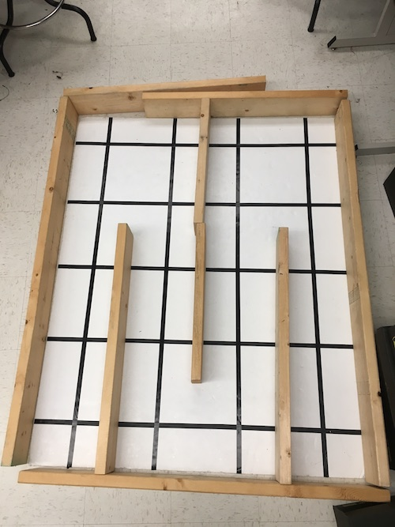

# Milestone 4

## Reading Data from the Arduino
In order for the FPGA to properly display any information onto the screen, we had to declare a series of variables that parsed the information received from the Arduino. Since we chose to use parallel communication between the FPGA and the base station Arduino, each bit of information sent from the Arduino is a physical wire connecting pins on both boards. Here are the variables and pins we used to read the arduino’s data.

```
prevmov: This one-bit signal tells the FPGA if the robot has previously moved a square.

currmov: This one-bit signal tells the FPGA if the robot has moved a square. 
It takes input from GPIO_1 pin 28.

Fwall: This one-bit signal is high when there is a wall 
detected in the front of the robot, and low when there is not. 
It takes input from GPIO_1 pin 1.

Lwall: This one-bit signal is high when there is a wall 
detected to the left of the robot, and low when there is not. 
It takes input from GPIO_1 pin 3.

Rwall: This one-bit signal is high when there is a wall 
detected to the right of the robot, and low when there is not. 
It takes input from GPIO_1 pin 5.

treasure: This two-bit signal defines what kind of 
treasure the robot has discovered. 
It concatenates the variables treasure1 and treasure2 
which take input from GPIO_1 pins 2 and 4, respectively.

Additionally, GPIO_1 pins 30 and 32 were used to signal 
x/y direction and +/- movement, respectively, but were not given variable names.
```
## Maze Navigation

Displaying the movement of the robot on the VGA was relatively simple. The robot is given an initial position using the variables x and y. Each time an instruction from the Arduino is passed to the FPGA, we check GPIO_1 pins 30 and 32 and enter nested if-else branches to determine the movement. Additionally, we can determine the robot’s direction with respect to the grid based on which direction it moves i.e. if the robot moves in the +y direction, it is facing N. Here’s the higher-level logic:

```
if(GPIO_1 pin 30 is low){
	//Change x value
	if(GPIO_1 pin 32 is low){
		Decrease x
		Robot’s facing East
	}
	Else{
		Increase x
		Robot’s facing West
	}
}
Else {
	//Change y value
	if(GPIO_1 pin 32 is low){
		Decrease y
		Robot’s facing South
	}
	Else{
		Increase y
		Robot’s facing North
	}
}
```

## Maze Display

For the visual portion of the graphics display. We initialize several 4x5 arrays to keep track of the treasure and wall data of each grid block; these arrays all have a value of 0 when something is present. We used the following arrays: visited (keeps memory of where robot has been), NWall, EWall, WWall, and SWall that tracks the presence or absence of the four walls of the grid.

First thing we must do for display is to determine where the pixel we are looking at is on our map. We determine the value of positionCase, a one bit which is 1 if the pixel is within our maze grid and 0 if it is outside. As the VGA display sweeps through each pixel, we also store the x and y coordinates of the block it is in into the variables gridX and gridY. This is determined through a series of if-elseif statements based on the bounds of each grid. 

[_In this video,_](https://youtu.be/cVw9e5u2-Zs) we pass in various treasure input signals to the FPGA. Each time we move, we cycle through the different frequencies of treasure, and display them as different colors on the screen.


### Treasure Display

For treasure display, we set up the following registers/variables:
> treasure: 2 bit value where 0 means no treasure detected, 1 means 7 kHz detected, 2 means 12 kHz detected and 3 for 17 kHz.

> treasures: 4x5 array to represent the grid. Each grid space contains a 2 bit value corresponding to the type of treasure found. 

> treasure1: least significant bit of treasure; input read from GPIO pin.

> treasure2: most significant bit of treasure; input read from GPIO pin.

To set treasure, we read from two GPIO pins and store the values in the treasure registers and update this value at the rising edge of the clock. 

To change the grid color based on the treasure as the robot is moving we go through the following steps:
> Check if the VGA driver is evaluating a pixel in the grid.

> If not at a wall location, check the value of current treasure at the pixel location. 

> Based on the treasure value, change the corresponding grid square to a different color (no treasure = red, 7 kHz = magenta, 12 kHz = yellow, 17 kHz = orange) by updating PIXEL_COLOR.

> Update the treasure array at grid location with the type of treasure.

> Mark the square as visited.

Visually, this means that when the robot moves to the next square, the movement will be signified by the corresponding treasure value. To hold that color in that location after it has been visited, we continuously check our treasure array as VGA loops through all the pixels on the screen. If a treasure is detected in the corresponding grid, we hold the same color as above. If there is no treasure, however, the grid changes color to cyan to mark that it is visited but no treasure exists. To implement this, we followed the same logic as above, but checked if the square had been visited or not. 


### Wall Display
An additional variable called wallPos is used to signify which wall (or corner) the current pixel is looking at. wallPos is 0 to 4 for the four cardinal direction walls (starting at N and moving clockwise), 5 if there is no wall, and 6-8 for each corner (once again starting at NE and moving clockwise). To eliminate priority issues that arose from only having cases for the four walls, we had an additional four for each corner.

To determine which (if any) walls are present. We use a case statement based on the direction the robot is facing (N, E, S, or W). Within each case statement we then check the value from the wall sensors (FWall, LWall, and RWall) and determine the which direction each corresponds to. For example, the left wall while facing North correspond to the West wall. Then, the sensor value is OR’d with the current value in the wall arrays to preserve memory of previously seen walls.

###  Updating Display 
The updating of each color is done in a case statement: one case for outside the grid and one case for pixels within the grid. For the outside grid case it simply checks for the done signal and changes the pixel color to black if we are not done mapping. If the current pixel is within the grid, then we check the following things and execute as follows:
	
```
if(robot is in grid current containing current pixel){
if(in a wall/corner and those walls are marked as present){
	Color green
}
Else{
	if(treasure detected){
		if(one of treasure values){ Decide Treasure based on treasure values and assign corresponding color}
		Else{
			Mark red
		}
	}
}
Mark grid spot as visited
}	
Else{
if(in a wall/corner and those walls are marked as present){
	Color green
}
Else{
	if(treasure detected){
		if(one of treasure values){ Decide Treasure based on treasure values and assign corresponding color}
		Else if (visited){
			Mark cyan
		}
		Else{
			Mark as white
		}
	}
}
Mark grid spot as visited
}
```

## Done Signal

### Done Visual Display

We signal done to the FPGA by changing the background of the maze from black to pink. We implemented this by having an one bit register, allDone, which signals when the maze has completely been traversed. We determine the value of allDone by checking if all our nodes in our visited 2D array have been visited at the rising edge of the clock. When allDone is 1 (all nodes visited), we set the background pixel color to pink, otherwise we set it to black. 

This signal does not account for unreachable nodes, so we will be updating the value of allDone based on curr_mov after the entire system has been integrated. 


### Audio Generation

When the robot is done traversing the maze and all of visitable nodes have been visited, a three tone signal is played that signals that the robot has finished. To implement this done signal we used similar code to what we used for our three frequency tone in lab 3. The main difference between lab 3 and this milestone is that we pass the variable enable_sound from our main DE0_Nano file to enable our audio rather than using an external signal from the Arduino. In the code, two counters are used - tone_duration_counter and tone_number_counter - to keep track of how long each tone is being played and what value is being output at that time. Depending on the tone that’s being played, the output will increment from 0 to 255 and decrement back to 0 at different frequencies. The clock that determines the time that it takes for the FPGA to do this, CLKDIVIDER, is calculated based on the frequency of the tone that is being played (CLKDIVIDER = 25000000 / (frequency of tone) / 2). Once a clock time is determined for the specific frequency, the program plays the signal for one second by calling the module makeTone. See [Lab 3](.//Lab3/Lab3.md) for more information.

The pseudocode for playing the sound is as follows:
```
Enable sound
Set frequency of tone to be played
Calculate clock cycles to play this frequency 
If tone has played for one second{
	Reset tone duration counter
	Switch to next tone
}
Else{
	Keep playing current tone, increment tone duration counter
}
```

To add sound, we initialized our play_tone module from lab 3, and integrated the tone controlling module into our VGA display code. We enable sound by setting our enable_sound to equal allDone (the visual done signal) so that the sound is generated only when the screen turns pink and all nodes are visited. 


>Figure 1. Actual Maze used for testing


>Figure 2. Virtual Maze after completion


[_Check out our robot navigate the maze!_](https://youtu.be/5IiT6Euqq5U)
